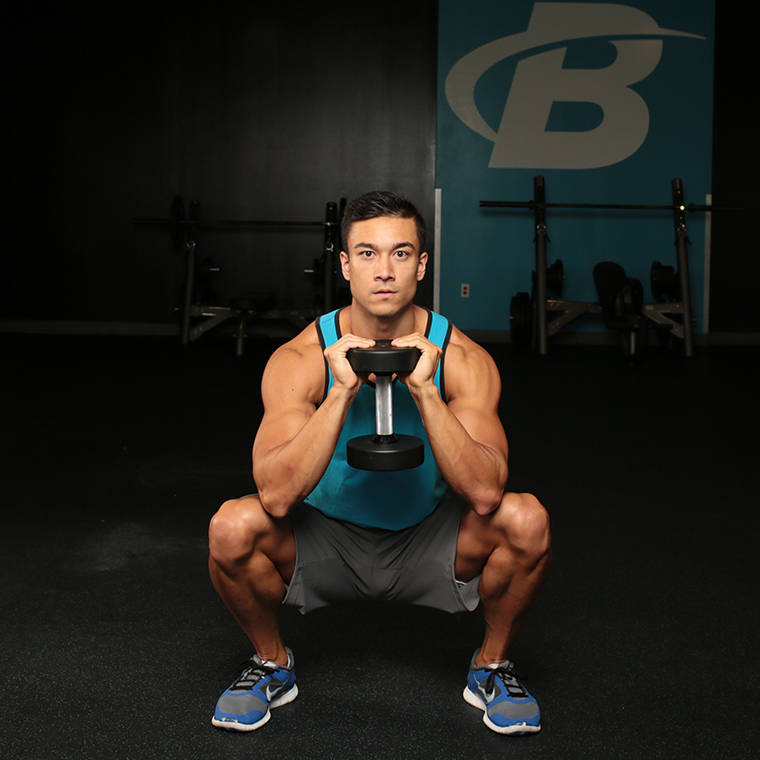
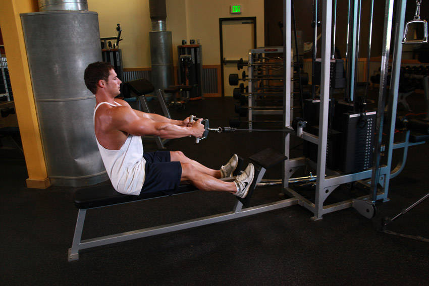
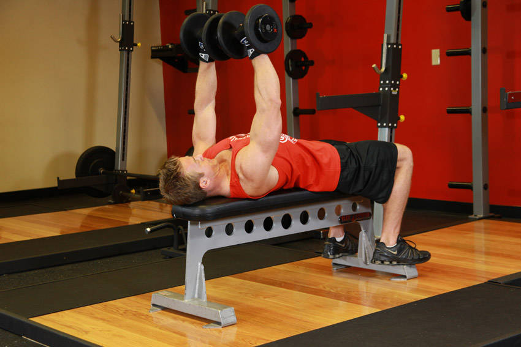
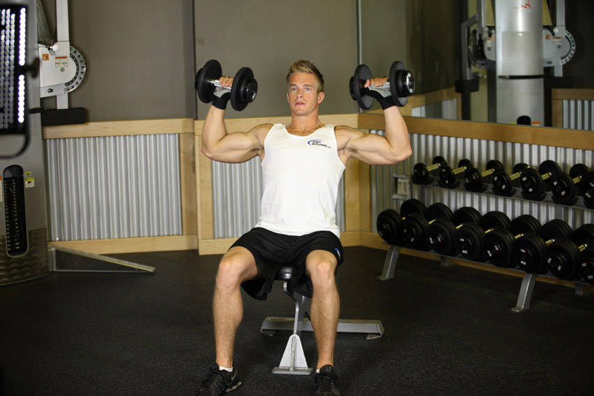
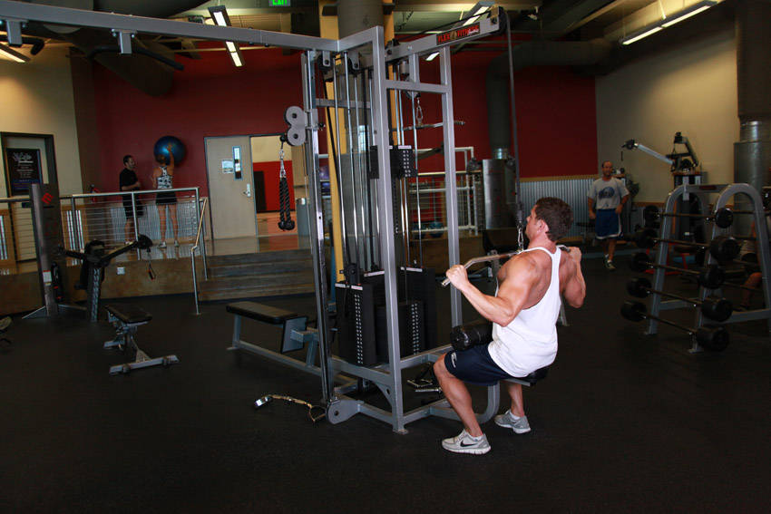

## Share your workouts

> It's all too easy to skip a session when you're the only person who knows about it.
>
> Sharing goals with pals or on social media can help you stay on track when the enthusiam wanes. - Men's Fitness

I reached out to my twitter bros asking for a beginner workout.

They did not disappoint.

My mate [Rob W. James](https://twitter.com/Rob_NBF) of [Nothing Barred Fitness](https://nothingbarredfitness.com/) gave me quick tips through twitter DMs. All done in less than 10 mins.

## How it works

> Pick 1 of each. That's workout A. Do this 3x per week.
>
> After a few weeks of getting used to this, create a different workout using the exercises you didn't pick before.
>
> That's workout B. Keeping the same 3 per week structure, now you can alternate ABA, BAB etc
>
> Start with 3x8 reps on everything.
>
> Add a rep every workout or 2 if you can.
>
> If you hit 3x10, go up in weight and back to 3x8.
>
> There you go. Really simple program. Should work for a good while
>
> Rob W. James

## Exercises

Here's the list of the recommended beginner exercises.

For reference, I use BodyBuilding.com's [exercise finder](https://www.bodybuilding.com/exercises/finder) videos on how to perform them correctly.

### Lower body

- Squat
- Deadlift

## Row

- Dumbell row
- Seated cable row
- Bent over barbell row

## Horizontal push

- Pushups
- Dumbell bench press
- Barbell bench press

_Incline variations of the exercises are possible options as well_

## Vertical push

- Dumbell overhead press
- Barbell overhead press

_These could be done in standing or in seated positions_

## Vertical pull

- Lat pulldown
- Chinups
- Pullups

_Chinups and pullups could be done assisted with bands_

## Workout A

Here's the beginner workout I decided on to start with.

- [Goblet Squat](https://www.bodybuilding.com/exercises/dumbbell-goblet-squat)

  

- [Seated cable row](https://www.bodybuilding.com/exercises/seated-cable-rows)

  

- [Dumbbell bench press](https://www.bodybuilding.com/exercises/dumbbell-bench-press)

  

- [Dumbbell overhead press](https://www.bodybuilding.com/exercises/seated-dumbbell-press)

  

- [Lat pulldown](https://www.bodybuilding.com/exercises/wide-grip-lat-pulldown)

  

I use the concept 2 row machine for a 500km or 5-10 minute warmup -- whichever comes first.

My program officially starts tomorrow.

**I'm really excited.**
