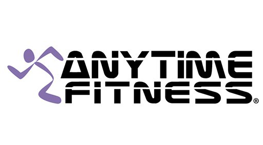
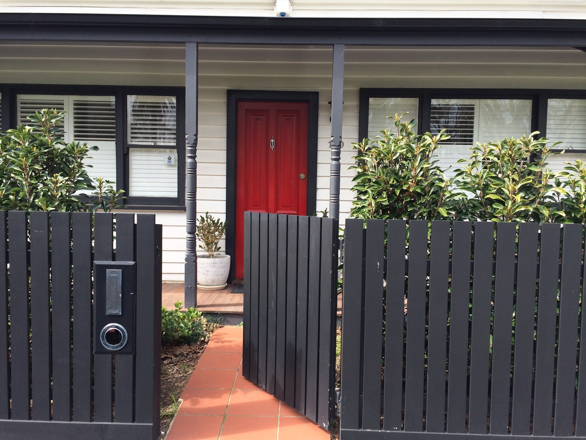

> Dear Mr Artajos,
>
> Paid In Full Letter
>
> Thank you for finalising your contract with Nissan Financial Services.
>
> The contract has now been paid in full and our legal interest in this vehicle will be removed, with all parties released from their obligations.
>
> Nissan Financial Services

## Fuck Yeah!

A while back, I wrote a post about [paying off our debts](https://fodra.github.io/domino-your-debts/).

Guess what?

**We finally did it!**

No \$506 monthly payments anymore! Five hundred and six dollars back in our pockets!

The letter in the mail which arrived on the 28 August 2019 was the cherry on top.

It was uneventful day.

There was no surprise that we became debt free because we decided early on we wanted to get out of it as fast as we can.

We were aggressive in paying the debt. Now we're reaping the rewards!

## What's next?

### 1. Travel to Japan with the whole family

Something the whole family is really keen on is going to Japan for a holiday!

Our aim is to pour our future savings to come up with a $10k - $12k budget for the trip.

The thing with paying of a 30k debt, coming up with a travel budget like this is no big deal.

### 2. Gym membership -- build my best body

I signed up to a gym membership already with Anytime Fitness. This is part of the company benefits and I'm taking advantage of it.

A project of mine is to [look my best before I turn 40](https://fodra.github.io/best-body/).

Without car payments I am more confident to put in money towards my health and well being.

### 3. Our home

We decided to put Japan first then after that milestone, we're setup for hitting bigger goals.

We need a bigger sum of money to make our home in Australia happen.

The discipline we put in paying down our debt will definitely help us to buy our first home here in Australia.

Just in time for our Australian Citizenship as well!
