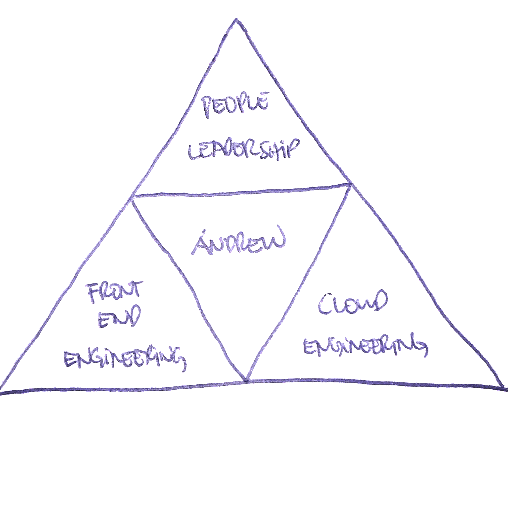

I am at my fourth manager already in my one year stint at Sportsbet.

He's the best people leader I've had so far.

So my last one-on-one with him, I had a productive session. I asked him all the stuff I wanted to know to succeed at Sportsbet or any other organisation for that matter.

He came up with this.

1. Make a triangle

Divide it into four equal parts.

At the centre, put down your name.

2. Identify three key areas you want to work on.

In my case, I've put down

a. Front End Engineering - this is my core work. Mainly Web and iOS using React, React Native, Typescript, HTML and CSS.

b. People Leadership - managing people, and doing stuff that will involve more communication to other teams.

c. Cloud Engineering - we have moved to AWS, knowing this part of the stack is essential in understanding how everything works.

3. Identify people in the organisation that could help you with those specific areas.

You can tag them as mentors.

For those key areas, position yourself to get tasks that are within those areas.

Only do tasks that would make you stronger in those specific areas.

## Parting words

This is how good a manager my current one is. He can give you a very simple and actionable task where you can improve and focus on for the future to move your career forward.

> "Your job is to build your resume while you're here."
>
> Matt Corrigan