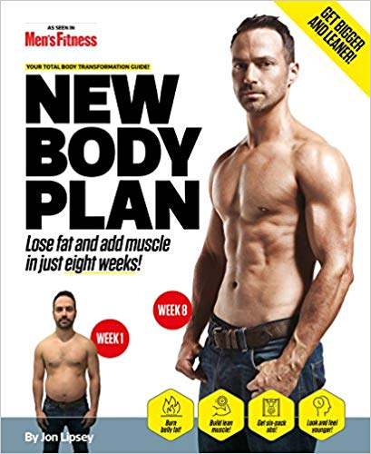

>  “If you fail to plan, you are planning to fail!”
>
> Benjamin Franklin

Two months ago, I signed up for a gym membership and started lifting weights.

I started with a [full body program](https://fodra.github.io/beginner-workout/).

I have noticed good results already but I want to get better results.

I ended up buying this book.

## New Body Plan

I already started Block 1 - Session 1 of the program today. My first session was awesome.

Here's a few things I found helpful in the program:

### 1. Warm up sets

This book recommends doing warm up sets. Do 2 sets of the exercise using very light weights.
After the two sets, do additional 3 sets with the proper weight -- enough to challenge you.

### 2. Pre-workout snack

That's basically a banana for me an hour before going to the gym. It works for me.

### 3. Squeezing the bar

This one is effective for me. It improves my grip strength and it helps me actively attack the exercises when I'm doing the reps.

Eight weeks from now, I'd be finished with the program.

Just in time to welcome the new year with a new body!

