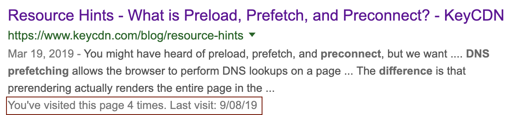

## [Establish network connections early to improve perceived page speed](https://web.dev/preconnect-and-dns-prefetch/)

> Browser support for dns-prefetch is slightly different from preconnect support, so dns-prefetch can serve as a fallback for browsers that don't support preconnect.
>
> ```html
> <link rel="preconnect" href="http://example.com" />
> <link rel="dns-prefetch" href="http://example.com" />
> ```

**This is the most important thing in this article.**

Using resource hints in your `<link>` tag is an easy way to improve a website's performance page load metric.

### How do I know?

I recently worked on performance improvements @ [Sportsbet](https://www.sportsbet.com.au/). It led down a rabbit hole of web performance articles and online course.

### Resources

These are the best resources to make your website faster.

1. **Google Web Fundamentals** - [Why Performance Matters?](https://developers.google.com/web/fundamentals/performance/why-performance-matters/)

2. **Website Performance Optimization** - [The Critical Rendering Path](https://www.udacity.com/course/website-performance-optimization--ud884) - A Udacity course by Ilya Grigorik and Cameron Pittman. I must say I can sense some tension between these guys. I think it's because of Ilya's super tight shirt -- Cameron looked distracted.

3. **Key CDN** - [Resource Hints](https://www.keycdn.com/blog/resource-hints). I found this very useful.
   

### But why bother?

_Because fast websites make money. Lots of it._
