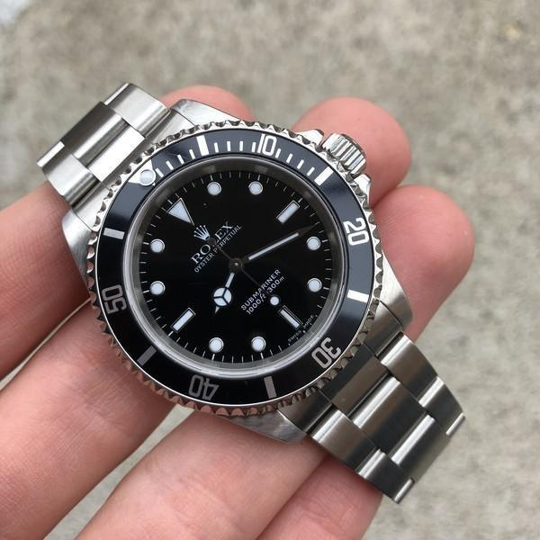
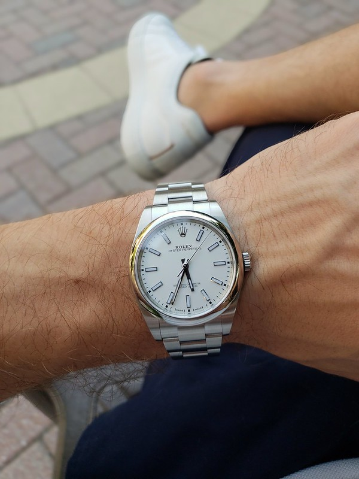
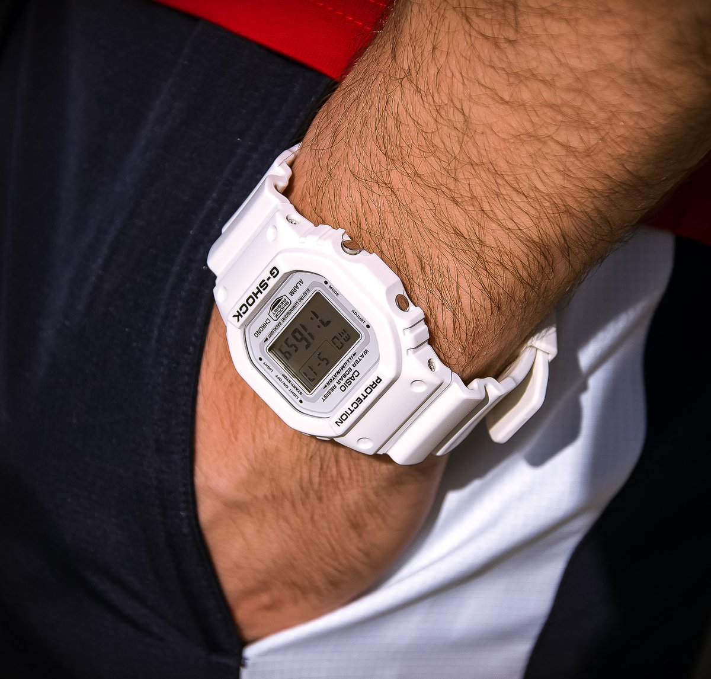

> I'm so self conscious that's why you always see me with at least one of my watches - Kanye West

I love watches.

I have amassed a good number of watches over the years -- also different watch straps.

It is a very expensive hobby that could easily go out of hand.

I stopped buying watches at the moment as we are saving up for our house. I do limit myself to _strap only_ purchases for now.

Over the years, I've come to realise I don't need more watches. I just need a few quality pieces that are versatile enough to adapt to all life scenarios.

I thought I should come up with a perfect watch collection.

Without saying anything more -- here's my three watch collection.

1. [Rolex Submariner No Date](https://www.ablogtowatch.com/rolex-submariner-ref-114060-date-watch-review/)

A black dial diver's watch in stainless steel. Every man should have one.

This watch started it all.

When I first saw the photo of this watch on ffffound.com, I was hooked. It was on an army green nato watch strap.

> Oh, you can put cool straps on a watch!?!

Yes, it has to be the Rolex Submariner **NO FRIGGIN DATE** because Rolex date windows are for the oldies.

**Versatile. Iconic. Classic.**

2. [Rolex Oyster Perpetual](https://monochrome-watches.com/rolex-oyster-perpetual-39-114300-white-dial-baselworld-2018-review-price/)

A white dial everyday watch in stainless steel.

Every man should have a white dial watch because it is clean, fresh, and classy.

This is the watch I could wear everyday and not get tired of it.

Change to a leather strap either black or brown will turn this watch into a dress watch.

**Clean. Crisp. Fresh.**

3. [Casio G Shock 5600](https://www.fratellowatches.com/you-asked-us-g-shock-square-which-one-to-choose/)

This is one of the toughest watch on Earth.

It's Japanese.

Bang for buck this is the best watch you could buy for less than a \$100.

This is the weekend watch. The watch you wear when you go home after work.

This is the watch you can wear in the grocery, mall, while gardening, doing the dishes -- your catch all watch.

Throw it around it will accept every thing you will throw at it. It rolls with the punches and still look cool.

You could pass it down to your kids -- and they will happily wear it.

You can even grow an entire collection just with this model.

**Every. Color. Imaginable.**
