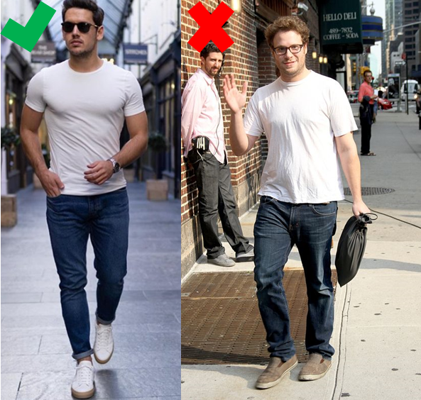

<blockquote class="twitter-tweet">
Style is not just about WHAT your wear but HOW you wear it. Seth Rogen here wearing a plain t-shirt, dark denim jeans. Items I fully endorse. But look at the fit and the lack of physique. Not helping him at all.  Credit: <a href="https://t.co/JD5HgB9eCh">https://t.co/JD5HgB9eCh</a> <a href="https://t.co/03vRaEWCJt">pic.twitter.com/03vRaEWCJt</a>
&mdash; WellBuiltStyle (@WellBuiltStyle) <a href="https://twitter.com/WellBuiltStyle/status/1157095698388570112?ref_src=twsrc%5Etfw">August 2, 2019</a></blockquote> 

## Three key points to take in here:

### 1. Physique
Men's style is really about the body. A muscular body is the base of the clothes you wear. You don't have to be really jacked like a super hero. You got to take care of the body and do the work in the gym. Build a strong and imposing physique -- without it everything would look sloppy.

### 2. Plain
Stick to solid colours. No branding.

### 3. Fit
It has to fit perfectly. Big mistake made by muscular men is picking clothes that are way too tight. On the other end of the spectrum, regular joes tend to pick clothes that are way too big -- making it look sloppy.

*for my 2 cents I also recommend having regular haircuts. I have a reminder in my calendar every month to get a haircut. It helps me look sharp.*

For more details follow:
[@WellBuiltStyle](https://twitter.com/WellBuiltStyle/status/1157095698388570112?ref_src=twsrc%5Etfw)
